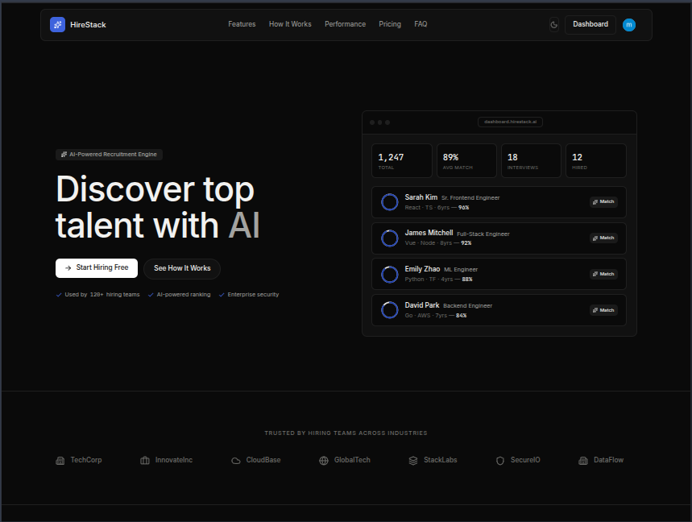
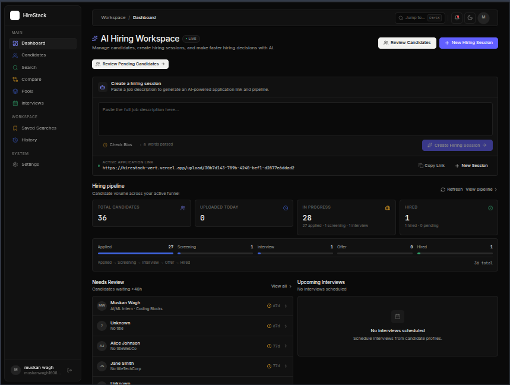
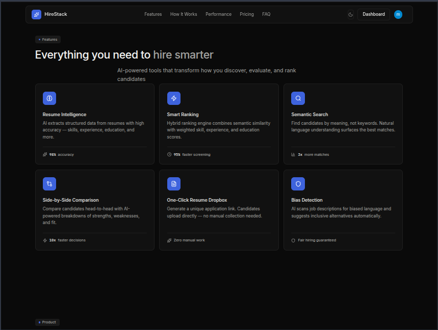
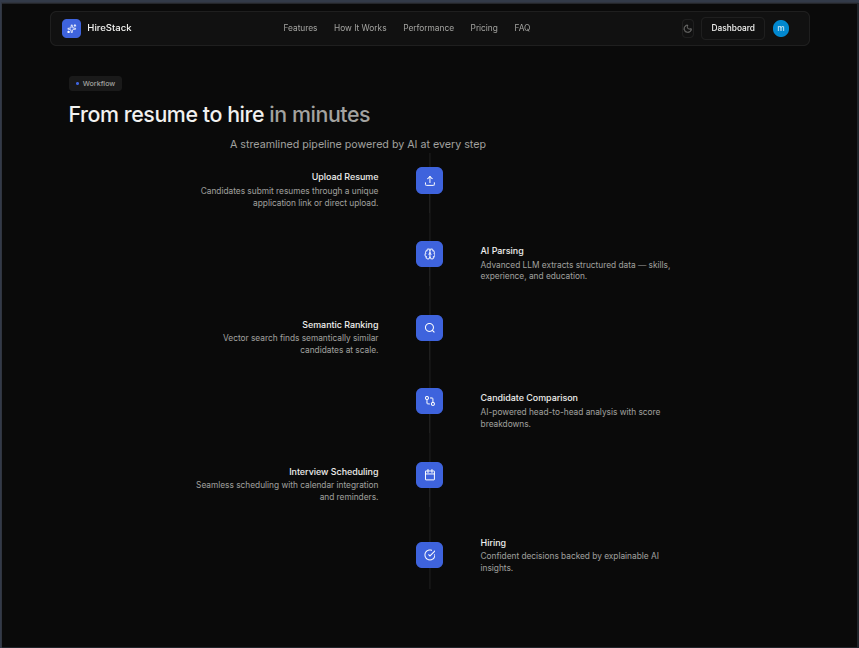
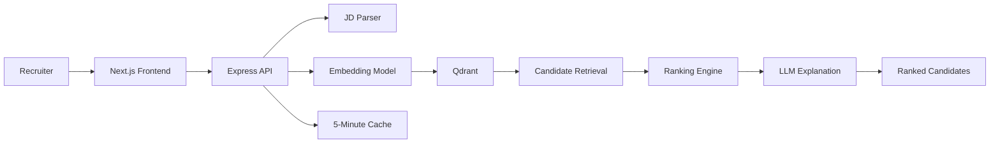

# AI-Powered Candidate Discovery & Ranking Engine

Recruiters paste a job description and get back semantically matched candidates —
retrieved with vector search, scored across multiple signals, and returned ranked
with LLM-generated explanations for every result.


## Product Preview

<p align="center">
  
  
</p>
<p align="center"><em>Landing hero and the AI Hiring Workspace where JDs become ranked shortlists.</em></p>

<p align="center">
  
  
</p>
<p align="center"><em>Platform capabilities and the resume-to-hire pipeline.</em></p>

## Why This Project?

Keyword filters miss strong candidates who phrase experience differently.
This engine retrieves by **meaning**, then grounds the order in structured
evidence — skills, experience, education — and has the LLM show its reasoning,
so a ranking is something a recruiter can trust and defend.

## Key Features

- Job description parsing into structured requirements
- Semantic candidate retrieval over Qdrant vector search
- Skill, experience, and education matching alongside vector similarity
- Explainable ranking with per-dimension score breakdowns
- Side-by-side candidate comparison with JD-aware pros/cons
- Candidate detail view with match analysis
- Search filters (experience range, skills, education level)
- LLM-powered analysis (parsing, comparison, explanations, bias scan)
- 5-minute TTL caching for repeated JD and search requests

## Architecture



The frontend is static/marketing plus the authenticated app; the Express API
owns parsing, embedding, retrieval, ranking, and explanation. Workers handle
resume ingestion asynchronously — the full staging topology is documented in
[`docs/performance-optimization-report.md`](./docs/performance-optimization-report.md).

## How It Works

`JD text → parse → embed → Qdrant search → rank → explain → cache`

### 1. Parse

The LLM converts the raw job description into structured requirements —
title, skills, experience range, education, responsibilities.

### 2. Embed

`Xenova/all-MiniLM-L6-v2` generates a 384-dimensional, L2-normalized embedding
of the JD locally — no per-request embedding API cost.

### 3. Retrieve

Qdrant runs cosine-similarity vector search against the `candidates`
collection, with optional payload filters (experience range, skills,
education level).

### 4. Rank

Each retrieved candidate is scored across semantic similarity, skills,
experience, and education, then blended into one weighted overall score.

### 5. Explain

The LLM generates per-candidate explanations and JD-aware comparisons with
pros/cons and a recommendation.

### 6. Cache

Repeated JD parses and search requests are served from a 5-minute TTL cache
instead of re-running LLM calls and vector search.

## Ranking Engine

Pure vector similarity is noisy on a small collection — scores cluster and the
order stops meaning anything. Blending semantic similarity with structured
candidate attributes keeps rankings stable and explainable.

| Dimension           | Weight | Method                   |
| ------------------- | -----: | ------------------------ |
| Semantic similarity |    35% | Cosine similarity        |
| Skills              |    30% | Jaccard + coverage       |
| Experience          |    20% | Experience-range scoring |
| Education           |    15% | Level + field matching   |

```text
Final Score =
semantic × 0.35 +
skills × 0.30 +
experience × 0.20 +
education × 0.15
```

Skill scoring mixes Jaccard similarity with coverage of required skills;
experience scores linearly within the JD's range (partial credit below the
minimum, full credit above the maximum); education combines level rank
(PhD > Master > Bachelor > Diploma) with field overlap.

## Candidate Comparison

Select multiple candidates and get a JD-aware, LLM-generated analysis:
per-candidate pros/cons and verdicts plus an overall recommendation with
comparative reasoning across the shortlist.

## Performance & Optimization

Live dashboard: [View Performance Dashboard](https://hirestack-vert.vercel.app/performance)

Three things are kept deliberately separate here: **measured results** from
staging, **techniques** implemented in code, and general **design**. The numbers
below come from the staging evaluation on 2026-09-12 (read-only against shared
services; authed-endpoint timing was not measured — no test auth token exists).
Details: [`docs/performance-optimization-report.md`](./docs/performance-optimization-report.md).

**Measured (staging):**

| Check | Result |
|---|---|
| 5 concurrent resume jobs | 5/5 ok, 0 failures, 0 retries, flat memory |
| API responsiveness under load | No degradation observed on public endpoints |
| Embedding cache, repeat text | 0 ms on repeat (bounded LRU, 200 entries / 1 h) |
| Stored-vector reuse | Identical bytes, zero inference per request |

**Techniques (all in code):**

- Shared SWR key and smaller page size cut duplicate dashboard fetching and
  overfetch (~84% fewer rows per load)
- Redis 5-minute cache with stale-while-revalidate on dashboard and search paths
- Calmer revalidation: 120 s polling, debounced/throttled WebSocket refetches,
  hidden-tab skip, section skeletons instead of a full-screen loader
- Single-flight embedding model loader plus LRU cache — one model instance per
  process under concurrency
- BullMQ safeguards: 180 s lock duration, processor timeouts, stable job IDs
  for duplicate suppression, fail-fast on corrupt resumes

**Design:** API and worker run as separate processes so embedding/CPU work
never blocks request handling; novel-JD search still embeds on the API event
loop (mitigated by cache) and first model load costs ~200 MB RSS one-time.

## Technology Stack

| Layer | Technologies |
|---|---|
| Frontend | Next.js 16, React 19, Tailwind CSS 4, shadcn/ui, Base UI |
| Backend | Node.js, Express.js 5, TypeScript |
| AI / RAG | OpenRouter (Qwen), `Xenova/all-MiniLM-L6-v2`, RAG + LLM workflows |
| Data | Qdrant (384-d, cosine), Supabase (Postgres + Storage) |
| Infra | Redis + BullMQ worker, Clerk auth |
| Engineering | Winston, dotenv, TTL caching, SWR/Zustand, REST APIs |

## Engineering Decisions

- **Local embeddings** — `all-MiniLM-L6-v2` runs in-process (quantized ONNX,
  384-d), so search has no embedding-API latency or cost. Hosted alternatives
  were evaluated and rejected: same-dimension models from other vendors live
  in a different vector space and would require a full re-embed.
- **Qdrant** — owns semantic retrieval: one 384-d cosine vector per candidate
  plus searchable payload (skills, experience, education) for filtered search.
- **Weighted ranking** — semantic similarity finds candidates who *mean* the
  right thing; structured attributes decide the order. Either signal alone is
  weaker than the blend.
- **Caching** — LLM calls and search results share a 5-minute TTL cache
  (Redis, with invalidation on mutations) because repeat JDs and dashboard
  revisits are common and recomputation is expensive.
- **Layered backend** — `Routes → Controllers → Services`, with async error
  handling, structured `AppError`s, Winston logging, startup env validation,
  and LLM retries with backoff.

## Setup

**Prerequisites:** Node.js 18+, npm, a Qdrant Cloud instance, and API keys
(OpenRouter, Supabase, Redis, Clerk). Create `backend/.env` with your keys —
required names and where to find each value are listed in
`backend/src/config/index.ts`; the server refuses to start if any are missing.

### Backend

```bash
cd backend
npm install
npm run dev
```

### Frontend

```bash
cd frontend
npm install
npm run dev
```

Run both together and open http://localhost:3000 — the frontend proxies
`/api/*` to the backend.
